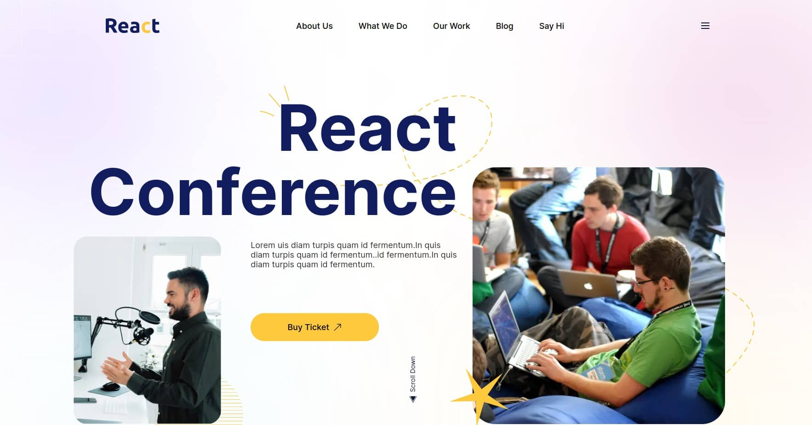

## &nbsp;

<h1 align="center">React Conference App</h1>

## Table of Contents

- [Table of Contents](#)
- [About](#about)
- [Prerequisites](#prerequisites)
- [Installing](#installing)
- [Third Party Dependencies](#third-party-dependencies)
- [Files And Directories Tree](#files-and-directories-tree)

## About

This application is a basic conference app built with Next.js. It consists of two main pages: a landing page displaying a dynamic list of conferences, and a details page showing comprehensive information about a selected conference. The technology stack includes:

- Next Js 14
- Tailwind CSS
- Typescript
- GraphQL

## Prerequisites

- [Node : ^18.17.1](https://nodejs.org/en/download/)
- [npm : ^9.11.0](https://nodejs.org/en/download/)
- [Yarn : ^1.22.10](https://classic.yarnpkg.com/en/docs/install)
- [Git](https://git-scm.com/downloads)

## Installing

- Open terminal or command prompt

- Clone the project

  > ```bash
  > git clone https://github.com/meinjam/react-conference.git
  > cd react-conference
  > ```

- Install required libraries for project

> `npm install`\
> _or,_ \
> `yarn`

- Run the code after installing the libraries

> `npm run dev`\
> _or,_ \
> `yarn dev`

_Note: Now this will run the app in the development mode and Open http://localhost:3000 to view it in the default browser._

- Create build file

> `npm run build` \
> _or,_ \
> `yarn build`

## Third Party Dependencies

- **_@apollo/client >= 3.9.6 :_** \
  _Apollo Client is a fully-featured caching GraphQL client with integrations for React, Angular, and more. It allows you to easily build UI components that fetch data via GraphQL._

- **_@apollo/experimental-nextjs-app-support >= 0.8.0 :_** \
  _Apollo Client support for the Next.js App Router_

- **_@radix-ui/react-accordion >= 1.1.2 :_** \
  _A vertically stacked set of interactive headings that each reveal an associated section of content._

- **_clsx >= 2.1.0 :_** \
  _A tiny (239B) utility for constructing className strings conditionally. Also serves as a faster & smaller drop-in replacement for the classnames module._

- **_dayjs >= 1.11.10 :_** \
  _Day.js is a minimalist JavaScript library that parses, validates, manipulates, and displays dates and times for modern browsers with a largely Moment.js-compatible API. If you use Moment.js, you already know how to use Day.js._

- **_react-sortablejs >= 6.1.4 :_** \
  _Sortable affects the DOM, adding, and removing nodes/css when it needs to in order to achieve the smooth transitions we all know an love._

- **_sass >= 1.71.1 :_** \
  _A pure JavaScript implementation of Sass. Sass makes CSS fun again._

- **_sortablejs >= 1.15.2 :_** \
  _Sortable is a JavaScript library for reorderable drag-and-drop lists._

- **_tailwind-merge >= 2.2.1 :_** \
  _Utility function to efficiently merge Tailwind CSS classes in JS without style conflicts._

## Files And Directories Tree

- **_.husky :_**\
  _Husky enhances your commits and more 🐶 woof! Automatically lint your commit messages, code, and run tests upon committing or pushing._
- **_public :_**\
  _Holds all public file._
- **_src :_** \
  _Holds js files which will be mostly edited._
  - **_app :_** \
    _Holds all the pages._
  - **_assets :_** \
    _Holds the static files like scss amd images._
    - **_scss :_**\
      _Holds the required scss for app._
    - **_img :_** \
      _Holds the required images for pages and components._
  - **_components :_** \
    _Holds all the component file regarding every page._
  - **_lib :_** \
    _Holds all the libraries which used in this application._
  - **_utils :_** \
    _Holds all the utilities which used in this application._
- **_.env_**
- **_.gitignore_**
- **_.prettierignore_**
- **_.prettier_**
- **_next-env.d.ts_**
- **_next.config.mjs_**
- **_postcss.config.js_**
- **_package.json_**
- **_package-lock.json_**
- **_README.md_**
- **_tailwind.config.ts_**
- **_tsconfig.json_**
